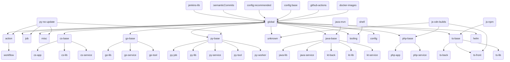

# Renovate dependencies
Documentation is [on notion](https://www.notion.so/Renovate-f455c421fc084ab38bf3145d243f7833).

```mermaid
graph TD;
py-no-update("py-no-update") --> action("action")
py-no-update("py-no-update") --> job("job")
py-no-update("py-no-update") --> misc("misc")
py-no-update("py-no-update") --> py-base("py-base")
docker-images("docker-images") --> global("global")
github-actions("github-actions") --> global("global")
config:base("config:base") --> global("global")
config:recommended("config:recommended") --> global("global")
:semanticCommits(":semanticCommits") --> global("global")
jenkins-lib("jenkins-lib") --> global("global")
java-mvn("java-mvn") --> java-base("java-base")
js-cdn-builds("js-cdn-builds") --> php-base("php-base")
js-cdn-builds("js-cdn-builds") --> ts-front("ts-front")
js-cdn-builds("js-cdn-builds") --> unknown("unknown")
js-npm("js-npm") --> ts-base("ts-base")
shell("shell") --> tooling("tooling")
global("global") --> action("action")
global("global") --> config("config")
global("global") --> cs-base("cs-base")
global("global") --> go-base("go-base")
global("global") --> helm("helm")
global("global") --> java-base("java-base")
global("global") --> job("job")
global("global") --> misc("misc")
global("global") --> php-base("php-base")
global("global") --> py-base("py-base")
global("global") --> tooling("tooling")
global("global") --> ts-base("ts-base")
global("global") --> unknown("unknown")
action("action") --> workflow("workflow")
cs-base("cs-base") --> cs-app("cs-app")
cs-base("cs-base") --> cs-lib("cs-lib")
cs-base("cs-base") --> cs-service("cs-service")
go-base("go-base") --> go-lib("go-lib")
go-base("go-base") --> go-service("go-service")
go-base("go-base") --> go-tool("go-tool")
java-base("java-base") --> java-lib("java-lib")
java-base("java-base") --> java-service("java-service")
java-base("java-base") --> kt-back("kt-back")
java-base("java-base") --> kt-lib("kt-lib")
java-base("java-base") --> kt-service("kt-service")
php-base("php-base") --> php-app("php-app")
php-base("php-base") --> php-service("php-service")
py-base("py-base") --> py-job("py-job")
py-base("py-base") --> py-lib("py-lib")
py-base("py-base") --> py-service("py-service")
py-base("py-base") --> py-tool("py-tool")
py-base("py-base") --> py-worker("py-worker")
ts-base("ts-base") --> ts-back("ts-back")
ts-base("ts-base") --> ts-front("ts-front")
ts-base("ts-base") --> ts-lib("ts-lib")
```